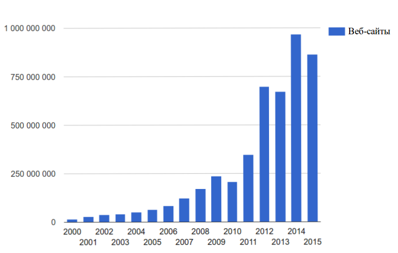

:tabsize: 16
:figure-caption!:

== ОГЛАВЛЕНИЕ
[cols="<17h,>1"]
|======================================
 |ВВЕДЕНИЕ                         | 5
 |Шлава 1. СОВРЕМЕННЫЕ ТЕХНОЛОГИИ  | 8
 |	1.1 Языки                      | 10
 d|  1.1.1 Markdown                | 11
 d|  1.1.2 Asciidoctor             | 11
 |  1.2 Текстовые редакторы        | 11
 d|  1.2.1 Sublime                 | 12
 d|  1.2.2 Brackets                | 12
 d|  1.2.3 Atom                    | 15
 |  1.3 Системы конроля версий     | 11
 d|  1.3.1 Git                     | 17
 d|  1.3.2 Mercurial               | 20
 d|  1.3.3 SVN (Subversion)        | 24
 |  1.4 Docker                     | 12
 |  1.5 Чаты для работы            | 13
 d|  1.5.1 Slack                   | 27
 d|  1,5.2 Telegram                | 28
 |Глава 2. АВТОМАТИЗАЦИЯ           | 14
 |  2.1 Роботы                     | 18
 |ЗАКЛЛЮЧЕНИЕ                      | 24
 |СПИСОК ЛИТЕРАТУРЫ                | 26
 |ПРИЛОЖЕНИЕ 1. Название           | 30
|======================================

<<<

== ВВЕДЕНИЕ

В XXI веке, веке стремительного и, можно даже сказать, лавинного развития различных интернет-технологий новые веб-сайты, приложения, интернет-услуги, веб-сервисы появляются чуть ли не каждый день. За последние 15 лет число веб-сайтов возросло на 1 миллиард, а пользователями интернета на данный момент является половина населения земного шара, хотя в 1995 году их доля не составляла и 1%.<<1>>

.График роста количества веб-сайтов в мире

С момента "рождения" Всемирной Паутины прошло не более 30 лет, а уже каждый второй житель нашей планеты имеет доступ к интернет-ресурсам и услугам. Это в первую очередь связано с уменьшением цены на различные гаджеты, увеличением их мобильности и постоянной разработкой новых устройств. Простота использования и лёгкий доступ к различным ресурсам обеспечили каждому пользователю возможность попробовать себя в роли разработчика. Таким образом, Всемирная Паутина - площадка, где всё создаётся людьми и для людей. Благодаря новым разработкам, удобным графическим интерфейсам, фреймворкам, форумам, платформам всё большее количество людей начинает использовать интернет-ресурсы. Такое распространение интернет-технологий открыло для нас совершенно новые возможности для бизнеса, работы и, в особенности, для обучения.

Однако, тенденция использования различных современных информационных технологий всё ещё не получила достаточно широкого признания. В особенности, она практически отсутствует в методическом обеспечении учебного процесса в современных ВУЗах нашей страны. Вот уже несколько лет студенты пользуются одними и теми же технологиями обработки и хранения данных, старыми программами, текстовыми редакторами - приходится постоянно конвертировать документы в уже давно устраевшие форматы. Это не только замедляет процесс обучения, но и не способствует приобщению студентов и преподавателей к мировому интернет-сообществу разработчиков, единомышленников и работодателей. Необходимо понять, что быть "на волне" современного информационного прогресса - значит иметь возможность быстрее найти сторонников своей идеи и реализовать себя в определённой сфере деятельности.

Одной из основных проблем, препятствующих внедрению новых информационных технологий в учебный процесс, является то, что львиная доля всей документации пишется на английском языке и редко переводится на русский язык. Хоть английский язык и является одним из преподаваемых курсов во многих ВУЗах, этого недостаточно, чтобы можно было спокойно прочитать и понять информацию, не заглядывая каждую минуту в словарь или онлайн-переводчик. Однако, если в учебном процессе будут постоянно использоваться и разбираться иностранные интернет-ресурсы, то студенты быстрее освоят технический английский язык и смогут укрепить и расширить свои познания в нужной им сфере деятельности, что принесёт огромную пользу не только в самообразовании, но и при поиске работы. Ни для кого уже не секрет, что в наше время знание английского языка является чуть ли не ключевым фактором при приёме на работу, особенно если эта работа связана с IT-технологиями.

Поэтому, в рамках данной курсовой работы ставятся следующие цели:

* ознакомление с наиболее популярными информационными технологиями нашего времени
* сравнение различных аналогов
* приведение примеров сфер их применения

<<<

== СПИСОК ЛИТЕРАТУРЫ

[#1]
1. Internet Live Stats. URL: http://www.internetlivestats.com
