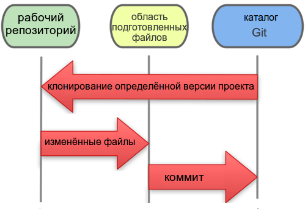

:figure-caption!:
:table-caption!:
:toc:
:toc-title: Оглавление
:toclevels: 4

<<<

== ВВЕДЕНИЕ

В XXI веке, веке стремительного и, можно даже сказать, лавинного развития различных интернет-технологий новые веб-сайты, приложения, интернет-услуги, веб-сервисы появляются чуть ли не каждый день. За последние 15 лет число веб-сайтов возросло на 1 миллиард, а пользователями интернета на данный момент является половина населения земного шара, хотя в 1995 году их доля не составляла и 1%.<<1>>

.График роста количества веб-сайтов в мире

С момента "рождения" Всемирной Паутины прошло не более 30 лет, а уже каждый второй житель нашей планеты имеет доступ к интернет-ресурсам и услугам. Это в первую очередь связано с уменьшением цены на различные гаджеты, увеличением их мобильности и постоянной разработкой новых устройств. Простота использования и лёгкий доступ к различным ресурсам обеспечили каждому пользователю возможность попробовать себя в роли разработчика. Таким образом, Всемирная Паутина - площадка, где всё создаётся людьми и для людей. Благодаря новым разработкам, удобным графическим интерфейсам, фреймворкам, форумам, платформам всё большее количество людей начинает использовать интернет-ресурсы. Такое распространение интернет-технологий открыло для нас совершенно новые возможности для бизнеса, работы и, в особенности, для обучения.

Однако, тенденция использования различных современных информационных технологий всё ещё не получила достаточно широкого признания. В особенности, она практически отсутствует в методическом обеспечении учебного процесса в современных ВУЗах нашей страны. Вот уже несколько лет студенты пользуются одними и теми же технологиями обработки и хранения данных, старыми программами, текстовыми редакторами - приходится постоянно конвертировать документы в уже давно устраевшие форматы. Это не только замедляет процесс обучения, но и не способствует приобщению студентов и преподавателей к мировому интернет-сообществу разработчиков, единомышленников и работодателей. Необходимо понять, что быть "на волне" современного информационного прогресса - значит иметь возможность быстрее найти сторонников своей идеи и реализовать себя в определённой сфере деятельности.

Одной из основных проблем, препятствующих внедрению новых информационных технологий в учебный процесс, является то, что львиная доля всей документации пишется на английском языке и редко переводится на русский язык. Хоть английский язык и является одним из преподаваемых курсов во многих ВУЗах, этого недостаточно, чтобы можно было спокойно прочитать и понять информацию, не заглядывая каждую минуту в словарь или онлайн-переводчик. Однако, если в учебном процессе будут постоянно использоваться и разбираться иностранные интернет-ресурсы, то студенты быстрее освоят технический английский язык и смогут укрепить и расширить свои познания в нужной им сфере деятельности, что принесёт огромную пользу не только в самообразовании, но и при поиске работы. Ни для кого уже не секрет, что в наше время знание английского языка является чуть ли не ключевым фактором при приёме на работу, особенно если эта работа связана с IT-технологиями.

Поэтому, в рамках данной курсовой работы ставится следующая цель:

Изучить наиболее популярные информационные технологии, потенциально применимые в области оформления документов, учебных и информационных материалов, и рассмотреть возможность их внедрения в учебный процесс.

<<<

== Глава 1. ФОРМАТИРОВАНИЕ ТЕКСТА - ЭТО ПРОСТО

Несмотря на то, что наиболее распространённой программой для редактирования текста является Microsoft Word, она имеет ряд недостатков, о которых мы даже не задумывались в силу принципа - "все ей пользуются, и я тоже буду". Тем временем, в мире информационных технологий появились утилиты и текстовые редакторы, поддерживающие различные языки разметки и имеющие более широкий спектр функций, чем стандартный Word. Далее мы рассмотрим различные утилиты и языки разметки, которые значительно упростят написание и стилизацию текста.

=== 1.1 Почему стоит забыть про Microsoft Word

Допустим, требуется создать методическое пособие или разработать какой-либо материал курса, который в последствии можно спокойно конвертировать в известные форматы, такие как PDF, HTML, eBook, wiki. Если делать это в Microsoft Word, то, во-первых, при конвертации в формат PDF ваши диаграммы, картинки, схемы могут сместиться в другое положение или даже "волшебным образом" пропасть из документа. О конвертации документа в HTML можно даже и не говорить. Безусловно, сущесвуют онлайн сервисы, выполняющие такой тип конвертации, но Вы можете сами при желании убедиться в их непрактичности.<<2>>

Во-вторых, при конвертации из того же DOC в PDF теряется стиль. Что тогда делать, если требуется оформить документа по ГОСТу? Придётся проводить махинации с поиском бесплатного PDF редактора или же приобретать ради этого лицензионную версию. Эти способы сомнительны и весьма мешают процессу создания какого-либо пособия или написания книги.

Третьей проблемой является неудобство прочтения методического пособия, выполенного в формате DOC, с устройств иного размера: со смартфонов, планшетов, электронных книг и т.д. На данный момент нет ни одного приложения, которые бы с точностью воспроизводили документ в формате DOC. Тем более, у всех устройств разные операционные системы, что ещё больше усложняет распротранение учебных материалов среди обучающихся.

Учитвая вышеупомянутые проблемы, определим принципы, на которых должны быть основаны утилиты для создания текстовых документов:

* Единый источник - много форматов. Написав текст единожды, мы должны иметь возможность конвертировать единый исходный документ в различные форматы.
* Стилизация конвертированных форматов. Необходимо иметь возможность редактировать стиль полученного формата.
* Простота написания. Процесс создания документа должен быть не сложнее, чем написание и форматирование текста в Microsoft Word.

Исходя из установленных принципов, мы останавливаем своё внимание на языках разметки Markdown, AsciiDoc и, в частности, на утилите Asciidoctor.

==== 1.1.1. Языки разметки AsciiDoc и Markdown

Начнём с определнеия. Язык разметки - это термин, обозначающий набор символов и последовательностей, с помощью которого можно визуализировать документ и настроить его стиль. Самым известным языком и стандартным языком разметки является HTML. Изначально его задумывали с целью сделать чтение веб-страниц удобным с устройств различной конфигурации, однако мы замечаем, что не все веб-сайты масштабируются в соответствии с размером гаджетов, и просмотр такой страницы становится проблематичным. Ещё одной проблемой HTML является сложность написания исходного документа. Если читать готовую веб-страницу просто, то её написание - процесс сложный, и "сырой" код совершенно не подходит для прочтения человеком. Здесь и приходят на помощь облегчённые языки разметки AsciiDoc и Markdown.

Писать методическое пособие, книгу, документацию в AsciiDoc и Markdown - одно удовольствие.<<3>> Создавая эти облегчённые языки разметки, разработчики хотели добиться, чтобы процесс написания каких-либо текстовых документов был не сложнее, чем написание e-mail. AsciiDoc и Markdown подразумевают под собой простой синтаксис, украшенный интуитивной и лёгкой разметкой. Текст, написанный в Asciidoc можно читать и в исходном документе. При подготовке к курсовой работе, мною был написан небольшой документ с помощью языка разметки AsciiDoc.

.Рис.1.1. Пример исходного документа с разметкой AsciiDoc
image::media/1.1.png[]

Видно, что написание текста с помощью разметки AsciiDoc не требует никаких особых знаний, кроме шпаргалки по синтаксису разметки.

Далее на сцену выступает утилита Asciidoctor. Не следует путать AsciiDoc и Asciidoctor! Asciidoctor - утилита, позволяющая конвертировать текстовый докумет на разметке AsciiDoc практически в любой формат. То есть она всецело поддерживает принцип "единый источник - много форматов". Рассмотрим конвертпцию в форматы PDF и HTML на примере моего документа.

.Рис.1.2 Исходный документ, конвертированный в PDF с помощью Asciidoctor
image::media/1.2.png[]

.Рис.1.3 Исходный документ, конвертированный в HTML с помощью Asciidoctor
image::media/1.3.png[]

<<<

С помощью всего двух команд<<4>> за 5 секунд я конвертировала документ в PDF и HTML. Данный пример показывает, насколько важен прицип единого источника. Распространение книг и материалов уже не будет проблемой, ведь исходник можно конвертровать практически в любой формат, а на устройствах других размеров производится автоматическое масштабирование без потери или смещения медиафайлов.

==== 1.1.2. Кастомная стилизация темы документа

В Microsoft Word, прежде чем начать писать текст, от нас требуется выбрать шрифт, его размер, межстрочный интервал, выставить отступы и т.п. И каждый раз, когда требуется написать текст другого размера или стиля, например подписать рисунок или изменить шрифт в таблице, приходится по-новой выставлять параметры, а затем снова возвращать прежние значения, чтобы продолжить писать. Кроме того, когда мы вставляем текст из другого источника, он появляется в нашем документе со своим шрифтом, размером, интервалами, и приходится снова подгонять его под требуемый нами стиль. Всё это только отвлекает от мылси и мешает сфокусироваться на написании текста. Корнем этих проблем ялвяется факт того, что Microsoft Word - текстовый процессор.

Текстовый процессор - программа, позволяющая редактировать текст, компоновать его макет и обладающая свойством WYSIWYG.<<5>> WYSIWYG (аббревиатура от What You See Is What You Get) подразумевает то, что редактируя текст, вы работаете с его конечным вариантом. То есть именно то, что вы видите, вы и получите. Несмортя на то, что можно "вживую" видеть, как будет выглядеть документ, это свойтсво как раз и влечёт за собой проблемы с совместимостью. И именно из-за WYSIWYG нельзя создать общую тему для всего документа, чтобы не мучаться с переключением параметров стиля.

Работая с утилитой AsciiDoc, вы форматируете текст в текстовом редакторе (в следующем пункте я подробнее раскрою эту тему). При надобности, можно создать отдельный файл с параметрами, задающими правила конвертации исходного файла формата ADOC в другие форматы.

Например, для задания темы конвертации PDF файла нужно создать файл конфигурации формата YAML (с расширением .yml).<<6>> Можно сказать, что YAML - упрощённая версия XML - читать и править его очень просто даже непросвещённому человеку.

.Рис.1.4.Пример задания размера, отступов и шрифтов документа
image::media/1.4.png[]

Аналогичными простыми можно задать размер каждого заголовка, размер текста в таблицах, расположение изображений и их подписей и т.д. Гораздо проще задать стиль конвертации один раз и использовать его во всех документах.

Например, такой подход мог бы значительно упростить студентам написание курсовой записки. Добиться правильного офрмления документа по ГОСТу можно было бы путём распространия среди студентов одного единственного файла конфигурации YAML.

==== 1.1.3. Предпросмотр в реальном времени

Текстовый редактор не обладает вышеупомянутым свойством WYSIWYG - он предназначен для редактирования простого текста. Самым известным текстовым редактором является Блокнот. В нём нельзя увидеть визуализацию создаваемого документа, проверить расположение картинок и других элементов, форматировать шрифт, стиль - в нём можно просто писать текст. Соврменные текстовые редакторы, такие как Sublime Text, Atom поддерживают сотни расширенийи и плагинов, позволяющих не только компенсировать недостатки Microsoft Word, но и улучшить и упростить процесс написания текста. Так, например, в текстовом редакторе Atom можно установить плагин, позволяющий видеть, как будет выглядеть документ формата HTML в специальном окне. Также можно просто установить соответствующий плагин предпросмотра документа в браузерах Chrome, Opera, Firefox. Стоит упомянуть утилиту Asciidoc FX.<<7>>

.Рис.1.5 Интерфейс Asciidoc FX

Asciidoc FX - текстовый редактор, предназначенный специально для форматирования текста с разметкой AsciiDoc и содержащий в себе функцию предпросмотра конвертированных документов PDF, HTML, eBook в режиме реального времени. Интерфейс редактора интуитивно простой и абсолютно удобен для написания документации, книг, пособий и пр. Важно заметить, что это мультиплатформенная утилита, а значит подойдёт абсолютно всем пользователям.

Разобрав альтернативные способы написания текста, можно сделать вывод, что текстовый процессор - не лучшая программа для написания книг. Отстутствие свойства WYSIWYG и принцип единого источника помогают избежать многих проблем с конвертацией, а наличие предпросмотра в реальном времени позволяет наблюдать, как изменяется документ в процессе редактирования.

=== 1.2. Сравнение языков разметки AsciiDoc и Markdown

Самым популярным облегчённым языком разметки является Markdown. Его главным преимуществом является примитивный синтаксис, но это так же и его главный недостаток.

Если применять AsciiDoc и Markdown для простого форматирования (для оформления заголовков, размеров шрифтов, вставок), то никакой разницы заметить нельзя. На данном уровне редактирования эти два языка разметки абсолютно одинаковы. Но когда дело доходит до перекрёстных ссылок, таблиц, вставки видео из Youtube и т.д., Markdown становится абсолютно неприемлимым инструментом для форматирования документа: для дальнейшего расширенного редактирования потребуются вставки "сырого" кода HTML, а так же установка множества расширений и плагинов.<<8>>

.Таблица 1.1 Сравнение возможностей языков разметки AsciiDoc и Markdown
[cols="4,5,5"]
|====================================
|                                         | Markdown             | Asciidoc
l| Ссылка на файл                          | [Открыть PDF]({{ site.url }}/МоиДокументы/Документ.pdf)  l| link:МоиДокументы/Документ.pdf[Открыть PDF]
| Включение других документов             |    -                 |    +
| Перекрёстная ссылка                     |    -                 |    +
| Вставка картинок как отдельных блоков   |    -                 |    +
| Возможность использования кастомных CSS |    -                 |    +
| Автогенерация колонки содержимого       |    -                 |    +
|====================================

Кроме того, сама утилита Markdown изначально может конвертировать исходный документ только в HTML. Для конвертации в другие форматы требуется поиск дополнительных расширений. В то время как Asciidoctor изначально предполагает возможность конвертации исходного документа в форматы PDF, HTML5, Docbook, eBook, презентации.<<9>>

AsciiDoc является гуманной и более гибкой альтернативой Markdown.

Он не потребует вставки HTML или какого-либо стороннего специального синтаксиса для добавления блоков, списков или колонки содержимого. Создатели AsciiDoc учли недостатки Markdown, а так же предусмотрели все возможные потребности при создании документа и включили в свой язык разметки варианты синтаксиса на любой случай. После установки AsciiDoc, не потребуется скачивание дополнительных расширений для различных ситуаций. Это основное и самое важное преимущество AsciiDoc перед Markdown.

=== 1.3. Сравнение текстовых редакторов Sublime Text и Atom

Так как синтаксис AsciiDoc - простой текст, то можно пользоваться абсолютно любым текстовым редактором. Однако, лучшим вариантом будет лёгкий и быстрый кроссплатформенный редактор с функцией подсветки синтаксиса AsciiDoc. Подсветка выделяет структуру документа, его различные элементы и помогает ориентироваться в тексте. Так как выбирается текстовый редактор специально для написания различных учебных материалов на языке разметки AsciiDoc, рассмотрим самые подходящие из них - Sublime Text и Atom.

Sublime Text написан на языках C++ и Python. Его графический интерфейс выглядит абсолютно одинаково на разных платформах (Linux, Windows, Mac), так как используется собственный UI-фреймворк. При продолжительном использовании предлагает приобрести лицензионную версию, но это не обязательно.

Atom же собран из 50 модулей и написан на C++, JavaScript, CSS и HTML. В отличие от Sublime Text, он абсолютно бесплатен и его код лежит в открытом доступе на GitHub, так что продвинутые пользователи постоянно дополняют его новыми плагинами и расширениями.

Сходства Sublime Text и Atom:

* У обоих приятный и гибко настраиваемый интерфейс
* Поддерживают функцию множественного выделения и редактирования
* Кроссплатформенны (Windows, Linux, Mac)
* Содержат огромную и постоянно пополняющуюся библиотеку плагинов и расширений
* Поддержка большого количества синтаксисов и их подсветка

Различия:

* Нстройка интерфейса и параметров в редакторе Atom производится непосредственно через графический интерфейс (GUI), в то время как для настройки Sublime требуется редактирование JSON-файлов конфигурации.
* В Atom плагины устанавливаются через визуальный интерфейс, а в Sublime - через установку Package Control.
* В последние годы Sublime Text стал реже обновляться, а Atom, наоборот, активно развивается и пополняется новыми плагинами.
* Опыт использования Atom показывает, что он не приспособлен для работы с файлами объёмом выше 10 Мб и может вызвать сбои. Sublime Text, напротив, с лёгкостью справляется с документами любых размеров без потери данных.
* Atom сделан на основе веб-технологий Chromium, Coffeescript, node.js, LESS, и каждая новая вкладка - это локально обрабатываемая web-страница. Последствием является медленная прогрузка кода и большее время старта, чем у Sublime Text.

Из представленных сравнений можно сделать вывод, что для небольших пособий размером до 10 Мб лучше всего подойдёт Atom, так как он проще в использовании, настройке и постоянно развивается пользователями. Возможно, что со временем разработчики найдут способ повысить скорость его работы, и тогда Atom станет абсолютным лидером среди текстовых редакторов. Однако, пока Atom ещё молод, следует форматировать документы в стабильно работающем Sublime Text, чтобы избежать потери данных и уменьшить затраты времени на обработку кода.

<<<

== Глава 2. СОВМЕСТНАЯ РАБОТА НАД МАТЕРИАЛАМИ КУРСА

В разработку материалов какого-либо курса обычно вовлечена целая команда составителей. Правильное распределение обязанностей - залог удачного проекта. Но если каждый член команды занимается разработкой отдельного фрагмента проекта, то возникает вопрос: "Как объединить разрабатываемые материалы в одном общедоступном месте?" Более того, должна быть возможность вернуться к предыдущей версии проекта, в случае неудачного обновления. С целью упростить процесс совместной работы над общим проектом были созданы различные веб-сервисы для хостинга проектов, вмещающие в себя системы контроля версий.

=== 2.1. Системы контроля версий

Предположим, Вы разрабатываете какой-либо материал курса. Вас попросили, в связи с какими-либо новыми требованиями, изменить некоторую часть материала, например, удалить ненужную главу, изменить тему оформления, исправить схему и т.д. Вы, конечно, подстрахуетесь и создадите копию файла на всякий случай. Появляются всё новые требования, поправки, и каждый раз Вы делаете копию старой версии файла. В итоге, в директории с материалом появляется что-то вроде "File, File1, File2, File3..." А что будет, когда работа производится над разными файлами? Директория станет переполнена непонятными файлами, и разобраться в ней будет крайне проблематично тому, кто с ней работает, не говоря уже о других членах команды. Для решения этой проблемы были созданы системы контроля версий.

Система контроля версий - система, которая регистрирует изменения в файлах, для того, чтобы в будущем была возможность вернуться к определённым версиям этих файлов.<<10>> Таким образом, директория с разарбатываемыми материалами всегда будет чистой, так как будет содержать файлы только нужной вам версии. Система контроля версий сохраняет версии изменений в своей базе данных, и, следовательно, визуально абсолютно не захламляет место в рабочей директории.

==== 2.1.1. Распределённые системы контроля версий (РСКВ)

Существует три вида систем контроля версий: локальные, централизованные (Subversion) и распределённые (Git и Mercurial).<<11>> Распределённая система контроля версий является самой надёжной. Во-первых, потому что репозиторий с проектом хранится на удалённом сервере. Во-вторых, потому что клиенты, работающие над проектом не просто выгружают с сервера последние версии материалов, но и полностью копируют весь репозиторий со всеми версиями проекта. Таким образом, в случае сбоя на сервере, любой клиент может загрузить все версии проекта обратно на сервер, восстановив базу данных и, наоборот, клиент может скачать репозиторий с сервера на любое устройство для дальнейшей работы.

.Рис.1.6 Схема распределённой системы контроля версий

Рассмотрим порядок действий, которые нужно знать для работы с распределённой системой контроля версий на примере Git:

. Скачивание каталога Git с удалённого сервера на локальное устройство. После этого этапа файлы локального репозитория считаются "зафиксированными".
. Работа с материалами в рабочем репозитории, изменение нужных файлов. Рабочий репозиторий - определённая версия проекта, извлечённая из сжатого каталога Git, который был скачан ранее. Изменёнными называются те файлы, которые поменялись, но не были зафиксированы.
. Пометка изменений файлов для внесения в последующий коммит. Эти пометки на данной стадии хранятся в специальном файле, который указывает, что должно будет войти в коммит. Такой файл принято называть индексом (index) или областью подготовленных файлов (staging area).
. Создание коммита с описанием внесённых изменений. Например "исправлена пунктуация в п.1.1". После коммита, файлы перемещаются из индекса в каталог Git и становятся фиксированными.
. Проталкивание зафиксированных файлов на удалённый репозиторий.

.Рис.1.7 Схема лоакльных операций при работе с распределённой системой контроля версий Git

==== 2.1.2. Веб-сервисы с поддержкой РСКВ

Операции по регистрации изменений и проталкиванию на удалённый сервис можно производить как через удобный графический интерфейс, например GitKraken<<12>>, так и через командную строку. Так же специально для удобной работы с распределёнными системами контроля версий были созданы веб-сервисы, позволяющие производить все необходимые операции через веб-интерфес. Самыми популярными среди аналогов являются сервисы GitHub<<14>> и Gitlab<<13>>. Они предоставляют сервера для размещения различных проектов и работы с ними. Gitlab моложе, чем GitHub и всё ещё развивается, однако у него есть одно веское преимущество - он абсолютно бесплатен. На GitHub можно создавать публичные репозитории, доступные всем пользователям, но чтобы создать приватный репозиторий для закрытой работы над проектом потребуется приобретение платного аккаунта. Таким образом, если планируется создание закрытого проекта, то лучше использовать GitLab, так как это бесплатная функция.

Оба веб-сервиса основаны на распределённой системе версий Git, которая на данный момент является наиболее распространённой. Так же GitHub и Gitlab поддерживают интеграцию с различными приложениями и чатами, которые позволяют видеть, кто что делает и какие именно изменения происходят в проекте. Об этом пойдёт речь в следующем пункте.

=== 2.2. Контроль проекта через чаты Slack и Telegram

<<<

== СПИСОК ЛИТЕРАТУРЫ

. [#1]#Internet Live Stats. URL: http://www.internetlivestats.com#

. [#2]#Онлайн конвертер DOC to HTML. URL: https://word-to-html.ru#

. [#3]#What is AsciiDoc? Why do we need it? URL: http://asciidoctor.org/docs/what-is-asciidoc#

. [#4]#Использование Asciidoctor URL: http://asciidoctor.org/#command-line-interface-cli#

. [#5]#Свойство WYSYWYG URL: https://ru.wikipedia.org/wiki/WYSIWYG#

. [#6]#Asciidoctor-PDF theming guide URL: https://github.com/asciidoctor/asciidoctor-pdf/blob/master/docs/theming-guide.adoc#

. [#7]#Asciidoc FX homepage URL: http://www.asciidocfx.com#

. [#8]#Markdown homepage URL: https://daringfireball.net/projects/markdown#

. [#9]#Плагин для создания презентаций в Asciidoctor URL: http://asciidoctor.org/docs/asciidoctor-revealjs#

. [#10]#What is version control. URL: https://www.atlassian.com/git/tutorials/what-is-version-control#

. [#11]#Version control systems. URL: https://git-scm.com/book/en/v2/Getting-Started-About-Version-Control#

. [#12]#GitKraken - Git GUI. URL: https://www.gitkraken.com#

. [#13]#About GitLab URL: https://about.gitlab.com#

. [#14]#About GitHub URL: https://github.com#
