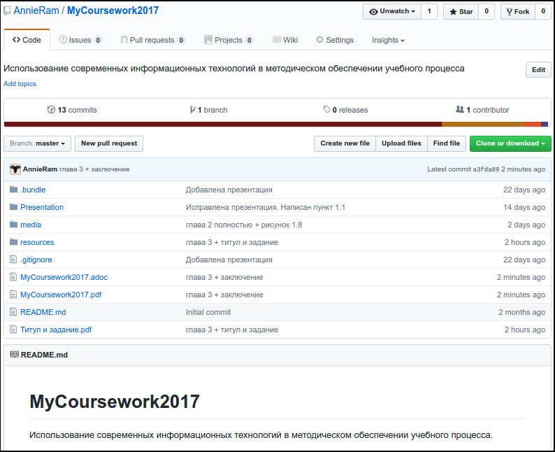

:figure-caption!:
:table-caption!:
:toc:
:toc-title: Оглавление
:toclevels: 4

<<<

== ВВЕДЕНИЕ

В XXI веке, веке стремительного и, можно даже сказать, лавинного развития различных интернет-технологий новые веб-сайты, приложения, интернет-услуги, веб-сервисы появляются чуть ли не каждый день. За последние 15 лет число веб-сайтов возросло на 1 миллиард, а пользователями интернета на данный момент является половина населения земного шара, хотя в 1995 году их доля не составляла и 1%.<<1>>

.График роста количества веб-сайтов в мире
image::media/1.png[web,500%]

С момента "рождения" Всемирной Паутины прошло не более 30 лет, а уже каждый второй житель нашей планеты имеет доступ к интернет-ресурсам и услугам. Это в первую очередь связано с уменьшением цены на различные гаджеты, увеличением их мобильности и постоянной разработкой новых устройств. Простота использования и лёгкий доступ к разнообразным ресурсам обеспечили каждому пользователю возможность попробовать себя в роли разработчика. Таким образом, Всемирная Паутина - площадка, где всё создаётся людьми и для людей. Благодаря новым разработкам, удобным графическим интерфейсам, фреймворкам, форумам, платформам всё большее количество людей начинает использовать интернет-ресурсы. Такое распространение интернет-технологий открыло для нас совершенно новые возможности для бизнеса, работы и, в особенности, для обучения.

Однако, тенденция использования различных современных информационных технологий всё ещё не получила достаточно широкого признания. В особенности, она практически отсутствует в методическом обеспечении учебного процесса в современных ВУЗах нашей страны. Вот уже несколько лет студенты пользуются одними и теми же технологиями обработки и хранения данных, старыми программами, текстовыми редакторами - приходится постоянно конвертировать документы в уже давно устраевшие форматы. Это не только замедляет процесс обучения, но и не способствует приобщению студентов и преподавателей к мировому интернет-сообществу разработчиков, единомышленников и работодателей. Необходимо понять, что быть "на волне" современного информационного прогресса - значит иметь возможность быстрее найти сторонников своей идеи и реализовать себя в определённой сфере деятельности.

Одной из основных проблем, препятствующих внедрению новых информационных технологий в учебный процесс, является то, что львиная доля всей документации пишется на английском языке и редко переводится на русский язык. Хоть английский язык и является одним из преподаваемых курсов во многих ВУЗах, этого недостаточно, чтобы можно было спокойно прочитать и понять информацию, не заглядывая каждую минуту в словарь или онлайн-переводчик. Однако, если в учебном процессе будут постоянно использоваться и разбираться иностранные интернет-ресурсы, то студенты быстрее освоят технический английский язык и смогут укрепить и расширить свои познания в нужной им сфере деятельности, что принесёт огромную пользу не только в самообразовании, но и при поиске работы. Ни для кого уже не секрет, что в наше время знание английского языка является чуть ли не ключевым фактором при приёме на работу, особенно если эта работа связана с IT-технологиями.

Поэтому, в рамках данной курсовой работы ставится следующая цель:

Изучить наиболее популярные информационные технологии, потенциально применимые в области оформления документов, учебных и информационных материалов, и рассмотреть возможность их внедрения в учебный процесс.

<<<

== Глава 1. ФОРМАТИРОВАНИЕ ТЕКСТА

Несмотря на то, что наиболее распространённой программой для редактирования текста является Microsoft Word, она имеет ряд недостатков, о которых пользователи не задумываются не желая выходить за рамки общепринятых стандартов. Тем временем, в мире информационных технологий появились утилиты и текстовые редакторы, поддерживающие различные языки разметки и имеющие более широкий спектр функций, чем стандартный Word. Далее мы рассмотрим разные утилиты и языки разметки, которые значительно упростят написание и стилизацию текста.

=== 1.1. Преимущества языков разметки

Допустим, требуется создать методическое пособие или разработать какой-либо материал курса, который в последствии можно спокойно конвертировать в известные форматы, такие как PDF, HTML, eBook, wiki. Если делать это в Microsoft Word, то, во-первых, при конвертации в формат PDF ваши диаграммы, картинки, схемы могут сместиться в другое положение или даже элементарно пропасть из документа. О конвертации документа в HTML можно даже и не говорить. Безусловно, сущесвуют онлайн сервисы, выполняющие такой тип конвертации, но Вы можете сами при желании убедиться в их непрактичности.<<2>>

Во-вторых, при конвертации из того же DOC в PDF теряется стиль. Что тогда делать, если требуется оформить документа по ГОСТу? Придётся проводить махинации с поиском бесплатного PDF редактора или же приобретать ради этого лицензионную версию. Эти способы сомнительны и весьма мешают процессу создания какого-либо пособия или написания книги.

Третьей проблемой является неудобство прочтения методического пособия, выполенного в формате DOC, с устройств иного размера: со смартфонов, планшетов, электронных книг и т.д. На данный момент нет ни одного приложения, которые бы с точностью воспроизводили документ в формате DOC. Тем более, у всех устройств разные операционные системы, что ещё больше усложняет распротранение учебных материалов среди обучающихся.

Учитывая вышеупомянутые проблемы, определим принципы, на которых должны быть основаны утилиты для создания текстовых документов:

* Единый источник - много форматов. Написав текст единожды, мы должны иметь возможность конвертировать единый исходный документ в различные форматы.
* Стилизация конвертированных форматов. Необходимо иметь возможность редактировать стиль полученного формата.
* Простота написания. Процесс создания документа должен быть не сложнее, чем написание и форматирование текста в Microsoft Word.

Исходя из установленных принципов, мы останавливаем своё внимание на языках разметки Markdown, AsciiDoc и, в частности, на утилите Asciidoctor.

==== 1.1.1. Языки разметки AsciiDoc и Markdown

Начнём с определения. Язык разметки - это термин, обозначающий набор символов и последовательностей, с помощью которого можно визуализировать документ и настроить его стиль. Самым известным и общепринятым языком разметки является HTML. Изначально его задумывали с целью сделать чтение веб-страниц удобным с устройств различной конфигурации, однако мы замечаем, что не все веб-сайты масштабируются в соответствии с размером гаджетов, и просмотр такой страницы становится проблематичным. Ещё одной проблемой HTML является сложность написания исходного документа. Если читать готовую веб-страницу просто, то её написание - процесс сложный, и "сырой" код совершенно не подходит для прочтения человеком. Здесь и приходят на помощь облегчённые языки разметки AsciiDoc и Markdown.

Писать методическое пособие, книгу, документацию в AsciiDoc и Markdown достаточно просто.<<3>> Создавая эти облегчённые языки разметки, разработчики хотели добиться, чтобы процесс написания каких-либо текстовых документов был не сложнее, чем написание email. AsciiDoc и Markdown подразумевают под собой простой синтаксис, представленный интуитивной и лёгкой разметкой. Текст, написанный в Asciidoc можно читать и в исходном документе. При подготовке к курсовой работе, мною был написан небольшой документ с помощью языка разметки AsciiDoc.

.Рис.1.1. Пример исходного документа с разметкой AsciiDoc
image::media/1.1.png[]

Видно, что написание текста с помощью разметки AsciiDoc не требует никаких особых знаний, кроме инструкции по синтаксису разметки.

Для последующей конвертации документа применяется утилита Asciidoctor. Не следует путать AsciiDoc и Asciidoctor. Asciidoctor - утилита, позволяющая конвертировать текстовый докумет на разметке AsciiDoc практически в любой формат. То есть она всецело поддерживает принцип "единый источник - много форматов". Рассмотрим конвертпцию в форматы PDF и HTML на примере моего документа.

.Рис.1.2. Исходный документ, конвертированный в PDF с помощью Asciidoctor
image::media/1.2.png[]

.Рис.1.3. Исходный документ, конвертированный в HTML с помощью Asciidoctor

<<<

С помощью всего двух команд<<4>> за 5 секунд можно конвертировать документ в PDF и HTML. Данный пример показывает, насколько важен прицип единого источника. Распространение книг и материалов уже не будет проблемой, ведь исходник можно конвертровать практически в любой формат, а на устройствах других размеров производится автоматическое масштабирование без потери или смещения медиафайлов.

==== 1.1.2. Пользовательское оформление документа

В Microsoft Word, прежде чем начать писать текст, от нас требуется выбрать шрифт, его размер, межстрочный интервал, выставить отступы и т.п. И каждый раз, когда требуется написать текст другого размера или стиля, например подписать рисунок или изменить шрифт в таблице, приходится по-новой выставлять параметры, а затем снова возвращать прежние значения, чтобы продолжить писать. Кроме того, когда мы вставляем текст из другого источника, он появляется в нашем документе со своим шрифтом, размером, интервалами, и приходится снова подгонять его под требуемый нами стиль. Всё это только отвлекает от мылси и мешает сфокусироваться на написании текста. Корнем этих проблем ялвяется факт того, что Microsoft Word - текстовый процессор.

Текстовый процессор - программа, позволяющая редактировать текст, компоновать его макет и обладающая свойством WYSIWYG.<<5>> WYSIWYG (аббревиатура от What You See Is What You Get) подразумевает то, что редактируя текст, вы работаете с его конечным вариантом. То есть именно то, что вы видите, вы и получите. Несмортя на то, что можно "вживую" видеть, как будет выглядеть документ, это свойтсво как раз и влечёт за собой проблемы с совместимостью. И именно из-за WYSIWYG нельзя создать общую тему для всего документа, чтобы не мучаться с переключением параметров стиля.

Работая с утилитой AsciiDoc, вы форматируете текст в текстовом редакторе. В случае необходимости, можно создать отдельный файл с параметрами, задающими правила конвертации исходного файла формата ADOC в другие форматы.

Например, для задания темы конвертации PDF файла нужно создать файл конфигурации формата YAML (с расширением .yml).<<6>> Можно сказать, что YAML - упрощённая версия XML - читать и править его очень просто даже непросвещённому человеку.

.Рис.1.4. Пример задания размера, отступов и шрифтов документа

Так же просто можно задать размер каждого заголовка, размер текста в таблицах, расположение изображений и их подписей и т.д. Гораздо проще задать стиль конвертации один раз и использовать его во всех документах.

Например, такой подход мог бы значительно упростить студентам написание курсовой записки. Добиться правильного оформления документа по ГОСТу можно было бы путём распространения среди студентов одного общего файла конфигурации YAML.

==== 1.1.3. Предпросмотр в реальном времени

Текстовый редактор не обладает вышеупомянутым свойством WYSIWYG - он предназначен для редактирования простого текста. Самым известным текстовым редактором является Блокнот. В нём нельзя увидеть визуализацию создаваемого документа, проверить расположение картинок и других элементов, форматировать шрифт, стиль - в нём можно просто писать текст. Соврменные текстовые редакторы, такие как Sublime Text, Atom поддерживают сотни расширений и плагинов, позволяющих не только компенсировать недостатки Microsoft Word, но и улучшить и упростить процесс написания текста. Так, например, в текстовом редакторе Atom можно установить плагин, позволяющий видеть в специальном окне, как будет выглядеть документ формата HTML в специальном окне. Так же можно установить соответствующий плагин предпросмотра документа в браузерах Chrome, Opera, Firefox. Стоит упомянуть утилиту Asciidoc FX.<<7>>

.Рис.1.5. Интерфейс Asciidoc FX
image::media/1.5.png[]

Asciidoc FX - текстовый редактор, предназначенный специально для форматирования текста с разметкой AsciiDoc и содержащий в себе функцию предпросмотра конвертированных документов PDF, HTML, eBook в режиме реального времени. Интерфейс редактора интуитивно простой и абсолютно удобен для написания документации, книг, пособий и пр. Важно заметить, что это мультиплатформенная утилита, а значит подойдёт абсолютно всем пользователям.

Разобрав альтернативные способы написания текста, можно сделать вывод, что текстовый процессор - не лучшая программа для написания книг. Отстутствие свойства WYSIWYG и принцип единого источника помогают избежать многих проблем с конвертацией, а наличие предпросмотра в реальном времени позволяет наблюдать, как изменяется документ в процессе редактирования.

=== 1.2. Сравнение языков разметки AsciiDoc и Markdown

Самым популярным облегчённым языком разметки является Markdown. Его главным преимуществом является примитивный синтаксис, но это так же и его главный недостаток.

Если применять AsciiDoc и Markdown для простого форматирования (для оформления заголовков, размеров шрифтов, вставок), то разница будет незаметна. На данном уровне редактирования эти два языка разметки абсолютно одинаковы. Но когда дело доходит до перекрёстных ссылок, таблиц, вставки видео из Youtube и т.д., Markdown становится абсолютно неприемлимым инструментом для форматирования документа: для дальнейшего расширенного редактирования потребуются вставки "сырого" кода HTML, а так же установка множества расширений и плагинов.<<8>>

.Таблица 1.1. Сравнение возможностей языков разметки AsciiDoc и Markdown
[cols="4,5,5"]
|====================================
|                                         | Markdown             | Asciidoc
l| Ссылка на файл                          | [Открыть PDF]({{ site.url }}/МоиДокументы/Документ.pdf)  l| link:МоиДокументы/Документ.pdf[Открыть PDF]
| Включение других документов             |    -                 |    +
| Перекрёстная ссылка                     |    -                 |    +
| Вставка картинок как отдельных блоков   |    -                 |    +
| Возможность использования кастомных CSS |    -                 |    +
| Автогенерация колонки содержимого       |    -                 |    +
|====================================

Кроме того, сама утилита Markdown изначально может конвертировать исходный документ только в HTML. Для конвертации в другие форматы требуется поиск дополнительных расширений. В то время как Asciidoctor изначально предполагает возможность конвертации исходного документа в форматы PDF, HTML5, Docbook, eBook, презентации.<<9>>

AsciiDoc является гуманной и более гибкой альтернативой Markdown. Утилитой AsciiDoc написании книг пользуются издатели O'Reilly Media<<10>>, различные научные журналы, например NFJS, а так же на нём написана документация по распределённой системе контроля версий Git.

AsciiDoc не потребует вставки HTML или какого-либо стороннего специального синтаксиса для добавления блоков, списков или колонки содержимого. Создатели AsciiDoc учли недостатки Markdown, а так же предусмотрели все возможные потребности при создании документа и включили в свой язык разметки варианты синтаксиса на любой случай. После установки AsciiDoc, не потребуется скачивание дополнительных расширений для различных ситуаций. Это основное и самое важное преимущество AsciiDoc перед Markdown.

=== 1.3. Сравнение текстовых редакторов Sublime Text и Atom

Так как синтаксис AsciiDoc состоит из простых символов, можно пользоваться абсолютно любым текстовым редактором. Однако, лучшим вариантом будет лёгкий и быстрый кроссплатформенный редактор с функцией подсветки синтаксиса AsciiDoc. Подсветка выделяет структуру документа, его отдельные элементы и помогает ориентироваться в тексте. Так как выбирается текстовый редактор специально для написания различных учебных материалов на языке разметки AsciiDoc, рассмотрим самые подходящие из них - Sublime Text и Atom.

Sublime Text написан на языках C++ и Python. Его графический интерфейс выглядит абсолютно одинаково на разных платформах (Linux, Windows, Mac), так как используется собственный UI-фреймворк. При продолжительном использовании предлагает приобрести лицензионную версию, но это не обязательно.

Atom же собран из 50 модулей и написан на C++, JavaScript, CSS и HTML. В отличие от Sublime Text, он абсолютно бесплатен и его код лежит в открытом доступе на GitHub, так что продвинутые пользователи постоянно дополняют его новыми плагинами и расширениями.

Сходства Sublime Text и Atom:

* У обоих приятный и гибко настраиваемый интерфейс
* Поддерживают функцию множественного выделения и редактирования
* Кроссплатформенны (Windows, Linux, Mac)
* Содержат огромную и постоянно пополняющуюся библиотеку плагинов и расширений
* Поддержка большого количества синтаксисов и их подсветка

Различия:

* Нстройка интерфейса и параметров в редакторе Atom производится непосредственно через графический интерфейс (GUI), в то время как для настройки Sublime требуется редактирование JSON-файлов конфигурации.
* В Atom плагины устанавливаются через визуальный интерфейс, а в Sublime - через установку Package Control.
* В последние годы Sublime Text стал реже обновляться, а Atom, наоборот, активно развивается и пополняется новыми плагинами.
* Опыт использования Atom показывает, что он не приспособлен для работы с файлами объёмом выше 10 Мб и может вызвать сбои. Sublime Text, напротив, с лёгкостью справляется с документами любых размеров без потери данных.
* Atom сделан на основе веб-технологий Chromium, Coffeescript, node.js, LESS, и каждая новая вкладка - это локально обрабатываемая web-страница. Последствием является медленная прогрузка кода и большее время старта, чем у Sublime Text.

Из представленных сравнений можно сделать вывод, что для небольших пособий размером до 10 Мб лучше всего подойдёт Atom, так как он проще в использовании, настройке и постоянно развивается пользователями. Возможно, что со временем разработчики найдут способ повысить скорость его работы, и тогда Atom станет абсолютным лидером среди текстовых редакторов. Однако, пока Atom ещё молод, следует форматировать документы в стабильно работающем Sublime Text, чтобы избежать потери данных и уменьшить затраты времени на обработку кода.

<<<

== Глава 2. СОВМЕСТНАЯ РАБОТА НАД МАТЕРИАЛАМИ КУРСА

В разработку материалов какого-либо курса обычно вовлечена целая команда составителей. Правильное распределение обязанностей - залог удачного проекта. Но если каждый член команды занимается разработкой отдельного фрагмента проекта, то возникает вопрос  объединения разрабатываемых материалов в одном общедоступном месте. Более того, должна быть возможность вернуться к предыдущей версии проекта, в случае неудачного обновления. С целью упростить процесс совместной работы над общим проектом были созданы различные веб-сервисы для хостинга проектов, вмещающие в себя системы контроля версий.

=== 2.1. Системы контроля версий

Предположим, Вы разрабатываете какой-либо материал курса. Вас попросили, в связи с какими-либо новыми требованиями, изменить некоторую часть материала, например, удалить ненужную главу, изменить тему оформления, исправить схему и т.д. Вы, конечно, подстрахуетесь и создадите копию файла на всякий случай. Появляются всё новые требования, поправки, и каждый раз Вы делаете копию старой версии файла. В итоге, в директории с материалом заполняется множеством копий одного и того же документа. В случае работы над разными файлами директория переполнится разными файлами и их копиями, и разобраться в ней будет крайне проблематично тому, кто с ней работает, не говоря уже о других членах команды. Для решения этой проблемы были созданы системы контроля версий.

Система контроля версий - система, которая регистрирует изменения в файлах, для того, чтобы в будущем была возможность вернуться к определённым версиям этих файлов.<<11>> Таким образом, директория с разрабатываемыми материалами всегда будет чистой, так как будет содержать файлы только нужной вам версии. Система контроля версий сохраняет версии изменений в своей базе данных, и, следовательно, визуально абсолютно не захламляет место в рабочей директории.

<<<

==== 2.1.1. Распределённые системы контроля версий (РСКВ)

Существует три вида систем контроля версий: локальные, централизованные (Subversion) и распределённые (Git и Mercurial).<<12>> Распределённая система контроля версий является самой надёжной. Во-первых, потому что репозиторий с проектом хранится на удалённом сервере. Во-вторых, потому что клиенты, работающие над проектом не просто выгружают с сервера последние версии материалов, но и полностью копируют весь репозиторий со всеми версиями проекта. Таким образом, в случае сбоя на сервере, любой клиент может загрузить все версии проекта обратно на сервер, восстановив базу данных и, наоборот, клиент может скачать репозиторий с сервера на любое устройство для дальнейшей работы.

.Рис.2.1. Схема распределённой системы контроля версий
image::media/1.6.png[]

Рассмотрим порядок действий, которые нужно знать для работы с распределённой системой контроля версий на примере Git:

. Скачивание каталога Git с удалённого сервера на локальное устройство. После этого этапа файлы локального репозитория считаются "зафиксированными".
. Работа с материалами в рабочем репозитории, изменение нужных файлов. Рабочий репозиторий - определённая версия проекта, извлечённая из сжатого каталога Git, который был скачан ранее. Изменёнными называются те файлы, которые поменялись, но не были зафиксированы.
. Пометка изменений файлов для внесения в последующий коммит. Эти пометки на данной стадии хранятся в специальном файле, который указывает, что должно будет войти в коммит. Такой файл принято называть индексом (index) или областью подготовленных файлов (staging area).
. Создание коммита с описанием внесённых изменений. Например "исправлена пунктуация в п.1.1". После коммита, файлы перемещаются из индекса в каталог Git и становятся фиксированными.
. Проталкивание зафиксированных файлов на удалённый репозиторий для общего доступа.

Описание внесённых изменений - очень удобная функция. В графическом интерпретаторе всегда будет видно и понятно, кто какие изменения совершил или какие поправки внёс. При неудачном исходе какого-либо обновления проекта всегда можно откатить проект к любой версии, которая потребуется. Не надо будет по несколько раз сохранять один и тот же проект для фиксации возможных вариантов развития на локальных устройствах, облаках, сервисах, ведь все версии проекта будут храниться в одном месте и не будут засорять рабочее место.

.Рис.2.2. Схема локальных операций при работе с распределённой системой контроля версий Git
image::media/1.7.png[scheme,400%]

==== 2.1.2. Веб-сервисы с поддержкой РСКВ

Операции по регистрации изменений и отправку на удалённый сервис можно производить как через удобный графический интерфейс, например GitKraken<<13>>, так и через командную строку. Так же специально для удобной работы с распределёнными системами контроля версий были созданы веб-сервисы, позволяющие производить все необходимые операции через веб-интерфейс. Самыми популярными среди аналогов являются сервисы GitHub<<14>> и Gitlab. Они предоставляют сервера для размещения различных проектов и работы с ними. Gitlab моложе, чем GitHub и всё ещё развивается, однако у него есть одно веское преимущество - он абсолютно бесплатен. На GitHub можно бесплатно создавать только публичные репозитории, доступные всем пользователям, но чтобы создать приватный репозиторий для закрытой работы над проектом потребуется приобретение платного аккаунта. Таким образом, если планируется создание закрытого проекта, то лучше использовать GitLab<<15>>, так как это бесплатная функция.

Оба веб-сервиса основаны на распределённой системе версий Git, которая на данный момент является наиболее распространённой. Так же GitHub и Gitlab поддерживают интеграцию с различными приложениями и мессенджерами, которые позволяют видеть, кто что делает и какие именно изменения происходят в проекте.

=== 2.2. Контроль проекта через корпоративные мессенджеры

Во время совместной работы над проектом важно иметь связь со своими коллегами или с учениками, чтобы в любой момент была возможность сообщить об ошибке, попросить совета по решению проблемы или же высказать появившуюся идею. Сейчас самым распространённым способом общения студента и преподавателя является email. Однако, это совершенно неудобно - сообщение с нужной информацией постоянно теряется среди сообщений по другим проектам и нет возможности создать удобную групповую переписку. Для целенаправленного общения членов группы какого-либо проекта был создан Slack.

==== 2.2.1. Преимущества корпоративного мессенджера Slack

Slack - это корпоративный мессенджер, обеспечивающий возможность обмениваться информацией, файлами, ссылками и поддерживающий интеграцию с большим количеством приложений.<<16>> Его использует при работе огромное количество кампаний, таких как NASA, Гарвардский университет, New York Times, Samsung, ebay, Electronic Arts и др. Он абсолютно удобен для общения членов команды проекта, позволяет интегрировать сторонние сервисы и собирать с них информацию прямо внутри самого мессенджера. Рассмотрим его основные преимущества и возможности.

* В Slack можно создать канал общения для каждого новой темы проекта. Например: "дизайн обложки", "материалы текста", "стилизация оформления" и т.д.
* Можно настроить уведомления таким образом, чтобы участники команды получали оповещения только когда их непосредственно упоминают в чате директным сообщением. Так же можно настроить отправку оповещений в email.
* Бесплатно доступны 5 гигабайт для загрузки в облако файлов общего доступа. Файлы, которыми вы делитесь в канале, можно комментировать.
* Есть поиск по сообщениям, включающий так же поиск внутри сохранённых PDF файлов.
* Интеграция с такими известными сервисами, как GitHub, Google Drive, Dropbox, Google Docs, Twitter и пр. Так же к чату можно прикрепить различных ботов, чтобы отслеживать какую-либо информацию (активность членов команды) или получать последние данные с какого-либо сайта, например информацию о смене курса валют или о погоде.
* Обеспечена возможность форматирования текста (например, если надо выделить наиболее важные детали сообщения).
* При надобности можно вставить фрагмент кода. Причём код будет подсвечен в соответствии с синтаксисом и отступами.
* Автоматическая подсветка hex-кодов цветов.
* Slack менее энергозатратный, чем, например, Skype.
* Абсолютная кроссплатформенность. Сервисами Slack можно пользоваться скачав приложение для Windows, Linux, Mac, Android или с помощью браузера.

Одной из самых интересных возможностей является создание канала для общения людей определённых интересов. В сети Интернет можно найти множество ссылок на разнообразные команды.<<17>> Можно найти каналы на практически любые темы: разработка под систему Android, программирование на Ruby, Python и т.д., сообщество для стартапов, канал для разработчиков робототехнических систем и многое другое. Как видим, Slack представляется не только как отличный корпоративный мессенджер для командной разработки, но и как способ найти единомышленников в интересующей сфере деятельности.

В последнее время набирает популярность новый мессенджер Telegram. Он содержит в себе практически все функции, какие есть в Slack, и, соответственно, возникает вопрос, не стоит ли перейти на Telegram. Однако в нём нет возможности вставить блок с подсвеченным кодом и, что самое важное, организовать командный чат, в котором можно создавать каналы для разных тем. Хоть Telegram и поддерживает интеграцию с огромным количеством приложений, использовать его в качестве корпоративного мессенджера неудобно.<<18>>

=== 2.3. Пример использования

Благодаря моему научному руководителю, студенты, проходившие курс "Операционные системы" с изучением языка программирования Python, имели возможность опробовать корпоративный мессенджер Slack на деле. Был создан специальный канал, в котором мы могли задавать вопросы по домашнему заданию, присылать сниппеты своих кодов и запрашивать результаты проверки работ. Так же сам курс разрабатывался командой в большей степени при помощи распределённых систем контроля версий Git и Mercurial и размещался на веб-сервисах GitHub и GitLab. Каждый работал над своей частью курса и затем отправлял изменения на веб-сервис. Оповещение об изменениях автоматически отправлялось в специальный канал по разработке курса в мессенджере Slack, и каждый член команды мог наблюдать работу своих коллег.

Мне тоже удалось принять небольшое участие в разработке данного курса программирования - я занималась переводами с английского языка некоторых глав курса по Python, предоставленных Джоном ДеНиро, которые используются с разрешения автора.<<19>> Русский текст писался при помощи разметки AsciiDoc в текстовом редакторе Sublime Text, а затем переведённые фрагменты отправлялись на веб-сервис GitHub и проверялись научным руководителем. Данный алгоритм разработки курса является на сегодня самым эффективным и наиболее популярным среди современных команд разработчиков.

Воспользовавшись этим алгоритмом создания проекта один раз, мне захотелось использовать его в любых своих начинаниях. Моя курсовая работа так же была написана при помощи данных технологий. Текст курсовой работы написан при помощи языка разметки AsciiDoc и конвертирован в PDF-файл, оформленный по ГОСТу при помощи файла конфигурации YAML. Поэтапные изменения моей курсовой работы фиксировались распределённой системой контроля версий Git и отправлялись на сервис GitHub. Ниже прикреплён скриншот, демонстрирующий графический интерфейс моего репозитория с курсовой работой.

.Рис. 2.3. Пример отображения репозитория на веб-сервисе GitHub

В графическом интерфейсе показаны все файлы моего репозитория с описанием последних внесённых изменений, а так же начальный файл Readme с описанием проекта. Интегрировав мой репозиторий на GitHub с мессенджером Slack, я получала оповещения об успешной отправке изменений на удалённый сервер. Интеграция с репозиторием происходит путём абсолютно элементарной опреации - нужно просто указать ссылку на свой проект на GitHub.

С помощью данного алгоритма можно создавать курсы абсолютно для любых специальностей. Базовый алгоритм действий следующий:

* Материалы курса (методички, книги, лекции, пособия, файлы с иллюстрациями) размещаются на веб-сервисе GitHub.
* Студентам даётся ссылка для скачивания этих материалов.
* По email рассылаются приглашения в соответствующий канал Slack, куда приходят уведомления об обновлениях курса благодаря интеграции с вашим GitHub репозиторием.

<<<

== Глава 3. АВТОМАТИЗАЦИЯ ПРОЦЕССА ОБУЧЕНИЯ

Автоматизация действий преподавателя, таких как проверка домашних заданий, проведение дополнительных тестов, укрепляющих знания в изучаемой сфере, всё чаще применяется в процессе обучения в наше время. При правильной подготовке автоматизированных тестов и организации материалов лекций такая методика преподавания будет способствовать лучшему пониманию предмета со стороны студентов и упрощению задачи для преподавателя. Таким образом, автоматизация процесса обучения влечёт за собой ряд неоспоримых преимуществ:

. Экономия времени преподавателя. При проверке домашних заданий, тратится много ценного времени, которое преподаватель мог бы потратить на отдых, работу или научные исследования. И чем больше судентов, тем больше домашних заданий для проверки. Этого можно избежать предварительно написав задания для самостоятельного выполнения и автоматизировав их проверку с последующей отправкой отчёта преподавателю и студентам.
. Справедливая система оценки знаний. В процессе проверки домашних заданий постепенно накапливается усталось и, соответственно, со временем становится всё сложнее сконцентрироваться на поиске ошибок. Имеют место случаи, когда оценка работы проставляется неверно или слишком субъективно. В случае автоматизированной проверки выполненных заданий, оценка производится точно в соответствии с введёнными ответами или сопоставленными значениями. Следовательно, у студентов не возникнет вопросов о несправедливости оценки.
. Лучшее освоение изучаемого предмета. Если лекции, презентации, пособия размещаются на специальном веб-сайте с материалами курса, то каждый студент может в любое время прочитать или перечитать неясные для него фрагменты. Кроме того, каждому свойственен свой темп обучения - кто-то может за 5 минут прочитать всю лекцию, а кому-то потребуется больше времени для разбора деталей. При таком подходе студентам даётся возможность самостоятельно распределять учебное время.
. Повышение интереса к предмету. Самостоятельно разобрав основы, представленные в электронных лекциях, студент будет приходить на пары с целью услышать что-то новое, а у преподавателя появится возможность раскрыть для обучаемых весь потенциал знаний, получаемых на данном курсе и поговорить о современных исследованиях в данной области.

Существуют разнообразные готовые платформы и онлайн-конструкторы учебных курсов, которые активно применяются российскими и зарубежными университетами при создании электронных курсов. Однако, эти способы могут не подойти некоторым преподаваемым специальностям, для которых понадобится создание уникальных систем контроля знаний. А значит может потребоваться создание собственной автоматизированной системы проверки домашних заданий. Пришло время поговрить о способах реализации данной системы.

=== 3.1. Простейшие способы автоматизации контроля знаний

Журналист и автор книги "Automate the Boring Stuff with Python", Эл Свейгарт, считает, что Python лучше всего подходит для решения подобных задач ввиду его интуитивного синтаксиса. Свою книгу он рассматривает как введение в программирование, а так же отличное пособие для тех, кто желает заняться автоматизацией различных процессов.<<22>>

==== 3.1.1. Скрипт для обработки вложений электронной почты

Самым простым способом автоматизации сортировки, скачивания и обработки электронной почты является написание скрипта. Email - это обыкновенный набор текстовых протоколов, настроенных для передачи информации между сетями. Задача сводится к созданию скрипта, скачивающего нужную электронную почту и прикреплённые вложения на локальное устройство. Для этого требуется написание алгоритма действий машины при помощи, например, языка Python. В результате запуска скрипта на локальную машину скачиваются нужные электронные письма, готовые для дальнейшей обработки или прочтения. Применяя такой скрипт можно сэкономить время на сборе домашних работ.<<20>>

==== 3.1.2. Робот в текстовом мессенджере Slack

Второй вариант реализации осуществляется при помощи текстового мессенджера Slack. Как уже упоминалось ранее, в Slack есть возможность создания собственного бота, который бы выполнял действия, указанные в его программном коде. Например, можно настроить робота так, чтобы он скачивал файлы с домашними работами, присланные студентами в специальный канал. Причём, можно настроить его таким образом, чтобы он скачивал только последние версии работ.

Однако, ни скрипт для обработки email сообщений, ни робот в мессенджере не подходят для работы с большим количеством студентов. Запуск скрипта обработки почты всё равно производится вручную, а робот в мессенджере не может присылать обучающимся отчёты о проверке заданий. Чтобы вся система автоматизированной проверки знаний была полностью самостоятельна и визуализирована в удобном графическом интерфейсе, потребуется создание полноценного веб-приложения.

==== 3.2. Веб-приложение для контроля и оценки знаний

Третий способ подразумевает создание веб-приложения, которое бы автоматически выполняло проверку загруженных домашних работ и выдавало в ответ отчёт об ошибках и количество набранных баллов. Так же в приложении можно разместить и сами формы с заданиями. Примером такой системы может служить система автоматизированных тестов Cisco Networking Academy.<<21>> Некоторые вопросы требуют выполнения задач в специальной программе Cisco Packet Tracer, которая позволяет студентам моделировать поведение виртуальных сетей. Эти модели систем затем сверяются с идеальной моделью, и из их соответствия производится рассчёт оценки. Такой способ автоматизации проверки знаний является наиболее эффективным и требует от преподавателя лишь проведения практических занятий, на которых студенты смогут найти применение полученным знаниям или попросить более детально разборать тему.

=== 3.2.1. Масштабирование веб-приложения

При создании веб-приложения может потребоваться размещение не одного, а сразу нескольких курсов на разные темы. Кроме того, количество пользователей с каждым годом будет расти и, следовательно, потребуется увеличение количества серверов. Ручной перенос целого курса на новый сервер потребует много времени, не говоря о том, что могут так же возникнуть проблемы совместимости при установке. Для таких целей нужно применять Docker.

Docker - открытая платформа для разработки, запуска и распространения приложений. Она позволяет упаковывать разработанное приложение и все его зависимости в контейнер, и затем быстро разворачивать на другом устройстве. Получившийся контейнер с приложением и его компонентами можно разворачивать абсолютно в любой среде: на веб-серверах, облачных пространствах, локальных компьютерах и пр. Кроме того, Docker-контейнер безопасно изолирован и не повлияет на окружающую его систему. Изоляция позволяет запускать сразу несколько Docker-контейнеров на одном устройстве, и они не будут противоречить друг другу.<<23>>

Алгоритм разработки такого веб-приложения сводится к следующим действиям:

. Разработка приложения, которое заключает в себе сами задания, программу автоматизированной обработки вводимых данных и последующнго выведения на экран отчёта о проверке.
. Упаковка приложения в Docker-контейнер и размещение на используемых серверах.

Docker легковесен и позволяет запускать приложение значительно быстрее, так как время тратится только на управление нужной инфраструктурой приложения.

<<<

== ЗАКЛЮЧЕНИЕ

В ходе курсовой работы были рассмотрены спсобы применения современных информационных технологий в разаработке методических материалов. Анализируя проведённые сравнения и выводы исследований можно отметить выполнение следующих поставленных задач:

. Выявлены преимущества современного языка разметки AsciiDoc перед стандартными текстовыми процессорами, а именно:
* возможность конвертации во многие другие форматы
* создание общей пользовательской темы документа
* простота и гибкость синтаксиса
* функция предпросмотра в реальном времени
. Проанализирован функционал лучших текстовых редакторов, Sublime Text и Atom, для написания пособий, книг и материалов. Приведены их сходства и различия.
. Представлены современные технологии для совместной работы над проектом, их применение и преимущества использования:
* Распределённые системы версий Git и Mercurial
* Веб-сервисы с поддержкой РСКВ GitHub и GitLab
* Корпоративный мессенджер Slack
. Определены этапы создания автоматизированной системы проверки знаний и простейшие способы её реализации:
* Скрипт для обработки вложений электронной почты
* Интегрированный робот в текстовом мессенджере Slack
. Установлен лучший вариант реализации автоматизированной системы обучения, а именно: создание веб-приложения с последующим масштабированием при помощи платформы Docker.

<<<

== СПИСОК ЛИТЕРАТУРЫ

. [#1]#Internet Live Stats [офиц. сайт]. URL: http://www.internetlivestats.com.#

. [#2]#Онлайн конвертер DOC to HTML [электр.ресурс]. URL: https://word-to-html.ru.#

. [#3]#Allen, D. What is AsciiDoc? Why do we need it? / D. Allen // URL: http://asciidoctor.org/docs/what-is-asciidoc.#

. [#4]#Asciidoctor // Asciidoctor CLI [офиц. сайт]. URL: http://asciidoctor.org/#command-line-interface-cli.#

. [#5]#WYSYWYG [офиц. сайт]. URL: https://ru.wikipedia.org/wiki/WYSIWYG.#

. [#6]#Asciidoctor-PDF // Theming Guide [офиц. сайт]. URL: https://github.com/asciidoctor/asciidoctor-pdf/blob/master/docs/theming-guide.adoc.#

. [#7]#Asciidoc FX // Homepage [офиц. сайт]. URL: http://www.asciidocfx.com#

. [#8]#Markdown // Homepage [офиц. сайт]. URL: https://daringfireball.net/projects/markdown.#

. [#9]#Плагин для создания презентаций в Asciidoctor. [офиц. сайт] URL: http://asciiдороу.org/docs/asciidoctor-revealjs.#

. [#10]#O'Reilly Media [офиц. сайт]. URL: https://ssearch.oreilly.com.#

. [#11]#Atlassian // What Is Version Control [офиц. сайт]. URL: https://www.atlassian.com/git/tutorials/what-is-version-control.#

. [#12]#Git-scm // Version control systems [офиц. сайт]. URL: https://git-scm.com/book/en/v2/Getting-Started-About-Version-Control.#

. [#13]#GitKraken // Git GUI [офиц. сайт]. URL: https://www.gitkraken.com.#

. [#14]#GitHub // About GitHub [офиц. сайт]. URL: https://github.com.#

. [#15]#GitLab // About GitLab [офиц. сайт]. URL: https://about.gitlab.com.#

. [#16]#Slack [офиц. сайт]. URL: https://slack.com/is.#

. [#17]#Slack communities [электр. ресурс]. URL: https://slofile.com (дата обращения 04.06.2017)#

. [#18]#Slack vs Telegram [электр.ресурс]. URL: https://www.slant.co/versus/4553/4568 (дата обращения 02.06.2017)#

. [#19]#DeNero, J. Composing Programs [электр.ресурс] / J. DeNero // URL: http://composingprograms.com (дата обращения 26.08.2016).#

. [#20]#Python 3 / An email and MIME handling package [офиц.сайт]. URL: https://docs.python.org/3/library/email.html.#

. [#21]#Cisco Networking Academy [офиц. сайт]. URL: https://www.netacad.com.#

. [#22]#Sweigart, L. Automate the Boring Stuff with Python [электр. ресурс] / L. Sweigart // URL: http://automatetheboringstuff.com.#

. [#23]#Docker [офиц. сайт]. URL: https://www.docker.com.#
